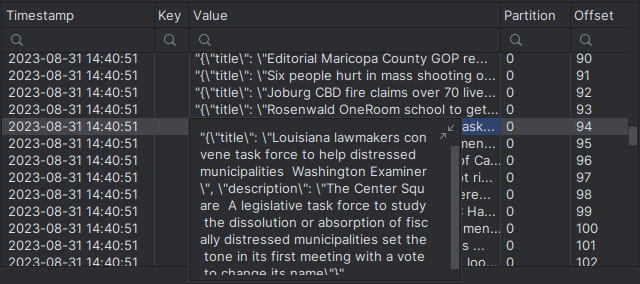

# SpringKafka demo Application
Simple Producer/Consumer Spring Boot application.
It listen for POST request on **"localhost:8080/publish"** with JSON body.

Every message will be saved on Kafka (test-topic).

1. Run Docker compose.yaml to start Kafka.
2. Run Spring Application.
3. Run python scraper.py to generate messages, or send it manually with postman.

